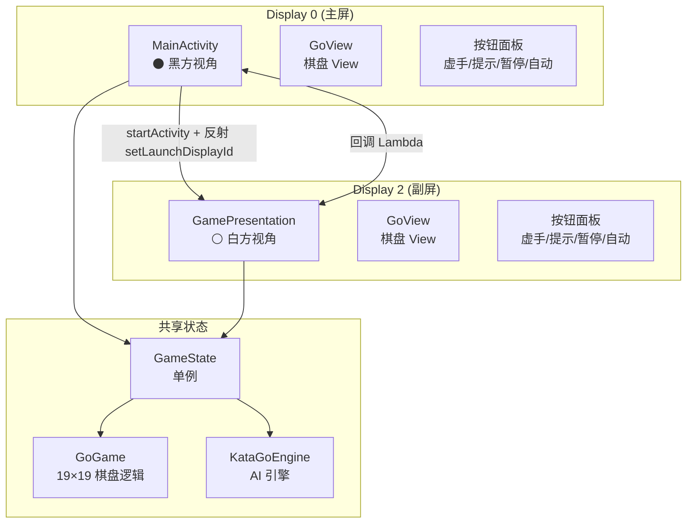
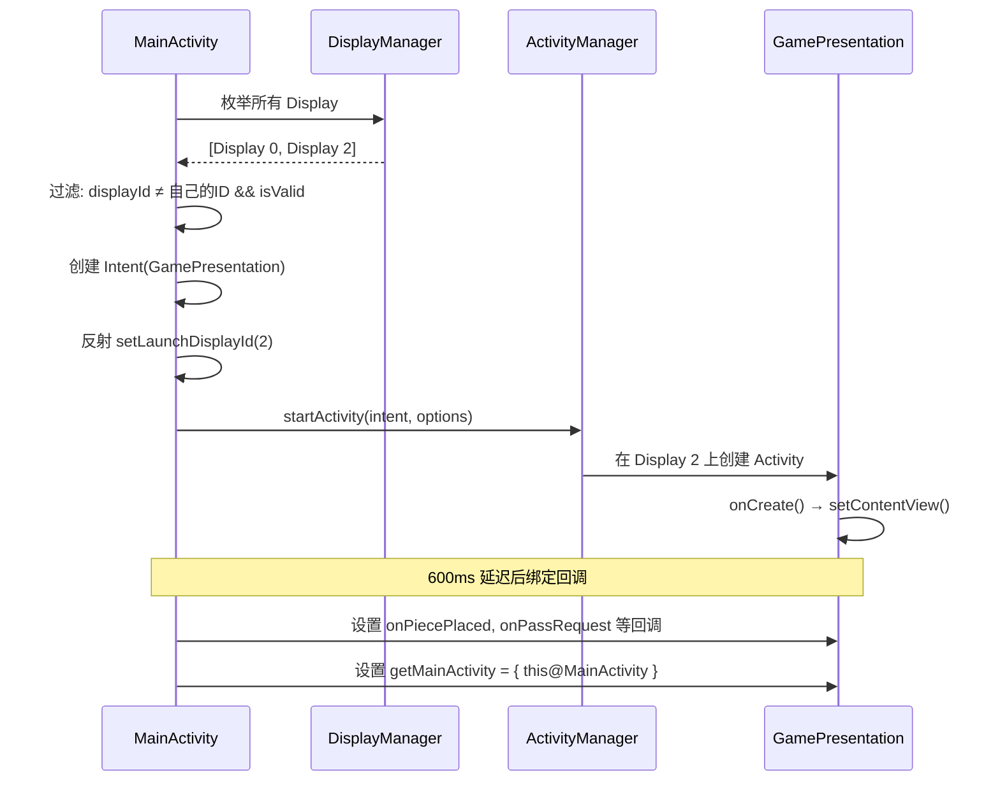

# 双屏异显开发指南 — V900 芯片平台

> 基于 **GoDualScreen (KataGo围棋双屏 V10.1)** 项目实战经验总结。
> 芯片: 8核 ARM Cortex-A73 + Mali-G52 6核 GPU，Android 12 (API 31)，双屏异显。
> 本文档可直接作为同平台其他双屏项目的开发参考。

---

## 目录

1. [硬件与显示拓扑](#1-硬件与显示拓扑)
2. [双 Activity 架构方案](#2-双-activity-架构方案)
3. [Display ID 枚举与适配](#3-display-id-枚举与适配)
4. [副屏 Activity 启动：反射 setLaunchDisplayId](#4-副屏-activity-启动反射-setlaunchdisplayid)
5. [主屏防呆机制](#5-主屏防呆机制)
6. [双屏通信架构](#6-双屏通信架构)
7. [Activity 生命周期管理](#7-activity-生命周期管理)
8. [AndroidManifest 配置要点](#8-androidmanifest-配置要点)
9. [芯片平台注意事项](#9-芯片平台注意事项)
10. [调试与问题排查](#10-调试与问题排查)
11. [实战踩坑与解决方案](#11-实战踩坑与解决方案)
12. [版本演进摘要](#12-版本演进摘要)

---

## 1. 硬件与显示拓扑

### 1.1 芯片特性

> 以下数据通过 `adb shell getprop` / `adb shell dumpsys display` / `adb shell cat /proc/cpuinfo` 从真机获取。

| 特性 | 规格 |
|------|------|
| **型号** | HL2.0 (huanglong) |
| **SoC** | 8核 ARM Cortex-A73 (CPU part 0xd09) |
| **GPU** | Mali-G52 (OpenGL ES 3.2 / OpenCL 3.0) |
| **CPU 架构** | arm64-v8a |
| **Android 版本** | 12 (SDK 31) |
| **显示输出** | 双独立显示控制器 (Display 0 + Display 2) |
| **主屏** | 内置屏幕, 1920×1280, 横屏 (Display 0) |
| **副屏** | 扩展屏幕, 1920×1280, 横屏 (Display 2) |
| **OpenGL 驱动** | `r35p0-01eac0` |

### 1.2 adb 采集命令

```bash
# 设备型号 & 制造商
adb shell getprop ro.product.model        # HL2.0
adb shell getprop ro.product.manufacturer  # HL2.0
adb shell getprop ro.hardware              # huanglong

# CPU 信息
adb shell cat /proc/cpuinfo | grep -E "CPU part|processor"
# CPU part: 0xd09 → ARM Cortex-A73

# GPU 信息
adb shell dumpsys SurfaceFlinger | grep "GLES:"
# GLES: ARM, Mali-G52, OpenGL ES 3.2

# 显示拓扑
adb shell dumpsys display | grep -E "Display Device|mViewports"
# Display 0: 内置屏幕, 1920×1280
# Display 2: 外部屏幕, 1920×1280
```

### 1.2 显示拓扑

```
┌─────────────────────────┐    ┌─────────────────────────┐
│     Display 0 (主屏)     │    │     Display 2 (副屏)     │
│                         │    │                         │
│  ⚫ 黑方视角             │    │  ⚪ 白方视角             │
│  MainActivity           │    │  GamePresentation       │
│                         │    │                         │
│  displayId = 0          │    │  displayId = 2          │
│  (DEFAULT_DISPLAY)      │    │  (扩展显示)              │
└─────────────────────────┘    └─────────────────────────┘
```

> **注意**: Display 1 在某些芯片上可能被保留（如 MIPI DSI 内屏），实际可用的扩展显示从 Display 2 开始。

---

## 2. 双 Activity 架构方案

### 2.1 方案对比

| 方案 | 优点 | 缺点 | 本项目选择 |
|------|------|------|:---------:|
| **Presentation API** | 官方支持、同进程 | 仅支持副屏为"第二屏"，UI能力受限 | ❌ |
| **双 Activity** | 完全独立的 UI 生命周期、各自管理 | 需手动处理通信、生命周期同步 | ✅ |

### 2.2 选型理由

对于**双人对弈**场景，两个屏幕需要独立交互（各自落子、各自按钮），双 Activity 方案更合适：

- 每个屏有独立的按钮（虚手、提示、暂停、自动、悔棋、开始）
- 每个屏有独立的触摸落子区域
- 每个屏有独立的倒计时和状态显示
- 屏幕内容不同（黑方视角 vs 白方视角）

### 2.3 架构图



---

## 3. Display ID 枚举与适配

### 3.1 获取所有 Display

```kotlin
val displayManager = getSystemService(Context.DISPLAY_SERVICE) as DisplayManager

for (display in displayManager.displays) {
    Log.i("Display", "ID=${display.displayId}, " +
          "name=${display.name}, " +
          "size=${display.mode.physicalWidth}x${display.mode.physicalHeight}, " +
          "valid=${display.isValid}")
}
```

### 3.2 典型输出（V900 平台）

```
Display ID=0  name=内置屏幕  size=1920x1080  valid=true
Display ID=2  name=HDMI 屏幕  size=1920x1080  valid=true
```

### 3.3 查找副屏的代码

```kotlin
private fun launchWhiteScreen() {
    val myDisplayId = display?.displayId ?: 0  // 当前 Activity 所在的 Display

    for (display in displayManager.displays) {
        // 跳过自己所在的屏幕，找第一个其他有效屏幕
        if (display.displayId != myDisplayId && display.isValid) {
            // 在这个 Display 上启动 GamePresentation
            launchOnDisplay(display.displayId)
            return  // 只启动一个副屏
        }
    }
}
```

### 3.4 常见 Display ID 映射

| Display ID | V900 平台 | 通用 Android | 说明 |
|:----------:|----------|-------------|------|
| 0 | 主屏 (LVDS/eDP) | `DEFAULT_DISPLAY` | 始终存在 |
| 1 | (保留/内屏) | 可能不存在 | 视硬件而定 |
| 2 | 副屏 (HDMI/DSI) | 扩展显示 | 本项目使用 |
| 3+ | 其他扩展 | 其他扩展 | 多屏场景 |

---

## 4. 副屏 Activity 启动：反射 `setLaunchDisplayId`

### 4.1 核心问题

Android 的 `ActivityOptions.setLaunchDisplayId(int)` 是 **API 26 (Oreo)** 引入的，但该方法被 `@hide` 标记，无法直接调用。

### 4.2 解决方案：反射调用

```kotlin
val intent = Intent(this, GamePresentation::class.java)

if (android.os.Build.VERSION.SDK_INT >= 26) {
    try {
        val options = android.app.ActivityOptions.makeBasic()
        // 反射调用隐藏 API: options.setLaunchDisplayId(displayId)
        val method = options.javaClass.getMethod(
            "setLaunchDisplayId",
            Int::class.javaPrimitiveType  // 参数类型: int
        )
        method.invoke(options, display.displayId)  // 传入目标 Display ID
        startActivity(intent, options.toBundle())
    } catch (_: Exception) {
        // 反射失败 → 降级为普通启动（会在当前屏打开）
        startActivity(intent)
    }
} else {
    startActivity(intent)  // API < 26 无此功能
}
```

### 4.3 关键注意点

| 项目 | 说明 |
|------|------|
| **方法签名** | `setLaunchDisplayId(int displayId)` |
| **参数类型** | `Int::class.javaPrimitiveType` (不是 `Int::class.javaObjectType`) |
| **API 限制** | 需 API ≥ 26，低版本降级启动 |
| **反射失败处理** | catch 后 `startActivity(intent)` 兜底 |
| **权限** | 无需额外权限（与 Presentation API 不同） |

### 4.4 完整启动流程



---

## 5. 主屏防呆机制

### 5.1 问题场景

用户可能通过以下方式在副屏上启动了 MainActivity：
- 系统将 App 恢复到上次所在的屏幕
- 多任务切换时的屏幕分配异常
- 开发调试时的意外启动

### 5.2 防呆代码

```kotlin
override fun onCreate(savedInstanceState: Bundle?) {
    super.onCreate(savedInstanceState)

    // ★ 极早期检测：必须在 setContentView 之前
    @Suppress("DEPRECATION")
    val launchedDisplayId = windowManager.defaultDisplay.displayId

    if (launchedDisplayId != Display.DEFAULT_DISPLAY) {
        // 当前不在主屏 → 强制迁回 Display 0
        val options = ActivityOptions.makeBasic()
        options.launchDisplayId = Display.DEFAULT_DISPLAY  // 这个 API 是公开的
        startActivity(
            Intent(this, MainActivity::class.java)
                .addFlags(Intent.FLAG_ACTIVITY_NEW_TASK or
                          Intent.FLAG_ACTIVITY_CLEAR_TASK),
            options.toBundle()
        )
        finish()  // 关闭当前（错误屏幕上的）实例
        return    // 不继续执行 onCreate
    }

    // --- 以下仅在主屏 (Display 0) 执行 ---
    // ... 正常初始化 ...
}
```

### 5.3 原理说明

| 步骤 | 说明 |
|------|------|
| `windowManager.defaultDisplay.displayId` | 获取当前 Activity 实际所在的屏幕 |
| `Display.DEFAULT_DISPLAY` | 恒等于 0，代表主屏 |
| `options.launchDisplayId` | 公开 API，可用于启动到指定屏幕 |
| `FLAG_ACTIVITY_CLEAR_TASK` | 清除旧任务栈，避免混乱 |

> **为什么 `setLaunchDisplayId` 需要反射但 `launchDisplayId` 不需要？**
> `ActivityOptions.launchDisplayId` 是公开字段（public field），在 API 26 加入。
> `ActivityOptions.setLaunchDisplayId(int)` 是 `@hide` 方法。
> 防呆代码中使用的是公开的 `launchDisplayId` 字段，无需反射。

---

## 6. 双屏通信架构

### 6.1 通信模式

本项目采用 **回调 Lambda + 单例共享** 模式：

```kotlin
// GamePresentation.kt — 声明回调接口
var onPiecePlaced: ((row: Int, col: Int) -> Unit)? = null
var onPassRequest: (() -> Unit)? = null
var onStartOrRestart: (() -> Unit)? = null
var onUndoRequest: (() -> Unit)? = null
var getMainActivity: (() -> MainActivity)? = null  // 获取主 Activity 引用
```

```kotlin
// MainActivity.kt — 绑定回调（在 launchWhiteScreen 中）
handler.postDelayed({
    GamePresentation.instance?.let { pres ->
        pres.onPiecePlaced = { r, c -> runOnUiThread { handlePiecePlaced(r, c) } }
        pres.onPassRequest = { runOnUiThread { handlePass(GoGame.PLAYER_WHITE) } }
        pres.onStartOrRestart = { runOnUiThread { onStartOrRestart(otherPerspective) } }
        pres.onUndoRequest = { runOnUiThread { requestUndo(otherPerspective) } }
        pres.getMainActivity = { this@MainActivity }
        gamePresentation = pres
    }
}, 600)  // 600ms 延迟，确保副屏 Activity 完全初始化
```

### 6.2 共享状态 (GameState 单例)

```kotlin
object GameState {
    lateinit var game: GoGame           // 棋盘逻辑
    var mainActivity: MainActivity? = null
    var kataGoEngine: KataGoEngine? = null
    @Volatile var useKataGo = false
}
```

### 6.3 通信方向总结

| 方向 | 方式 | 示例 |
|------|------|------|
| 副屏 → 主屏 | 回调 Lambda | 落子、虚手、开始、悔棋 |
| 主屏 → 副屏 | 直接方法调用 | 更新状态、倒计时、动画 |
| 双向共享 | GameState 单例 | 棋盘数据、引擎状态 |

### 6.4 线程安全

```kotlin
// 所有回调都切换到主线程
pres.onPiecePlaced = { r, c -> runOnUiThread { handlePiecePlaced(r, c) } }

// GameState 中的 Volatile 变量
@Volatile var useKataGo = false  // 多线程读写安全
```

---

## 7. Activity 生命周期管理

### 7.1 关键生命周期处理

```kotlin
// MainActivity.kt

// 退出应用 — 必须先关闭副屏
private fun exitApp() {
    try { gamePresentation?.finish() } catch (_: Exception) {}
    gamePresentation = null
    GamePresentation.instance = null
    BgMusic.stop()
    GameState.kataGoEngine?.shutdown()
    handler.postDelayed({ finishAffinity() }, 150)
}

// Home 键 — 直接退出（双屏应用不适合后台）
override fun onUserLeaveHint() {
    super.onUserLeaveHint()
    finishAffinity()
}

// 返回键 — 直接退出
override fun onBackPressed() {
    finishAffinity()
}

// 从后台恢复 — 如果副屏丢失则重建
override fun onRestart() {
    super.onRestart()
    if (gamePresentation == null) launchWhiteScreen()
}

// 销毁 — 清理所有资源
override fun onDestroy() {
    stopRemindTimers()
    SoundFX.release()
    BgMusic.stop()
    try { gamePresentation?.finish() } catch (_: Exception) {}
    GameState.kataGoEngine?.shutdown()
    super.onDestroy()
}
```

### 7.2 配置变更处理

```kotlin
// AndroidManifest.xml
android:configChanges="orientation|screenSize|screenLayout|keyboardHidden|smallestScreenSize"

// MainActivity.kt
override fun onConfigurationChanged(newConfig: Configuration) {
    super.onConfigurationChanged(newConfig)
    initMainUI()       // 重建 UI 布局
    launchWhiteScreen() // 重建副屏
    if (game.isActive) startRemindTimers()
}
```

> **重要**: 副屏的 GamePresentation 也要设置相同的 `configChanges`，否则旋转屏幕会导致副屏 Activity 被销毁重建。

---

## 8. AndroidManifest 配置要点

```xml
<manifest>

    <!-- ⚠️ 双屏异显必需权限 -->
    <uses-permission android:name="android.permission.SYSTEM_ALERT_WINDOW" />

    <!-- 声明支持多屏幕（但不强制） -->
    <uses-feature android:name="android.software.leanback" android:required="false" />
    <uses-feature android:name="android.hardware.touchscreen" android:required="false" />

    <application
        android:resizeableActivity="true">  <!-- 支持多窗口/多屏 -->

        <!-- 主屏 Activity -->
        <activity
            android:name=".MainActivity"
            android:exported="true"
            android:screenOrientation="landscape"
            android:configChanges="orientation|screenSize|screenLayout|keyboardHidden|smallestScreenSize">
            <intent-filter>
                <action android:name="android.intent.action.MAIN" />
                <category android:name="android.intent.category.LAUNCHER" />
            </intent-filter>
        </activity>

        <!-- 副屏 Activity — 关键配置 -->
        <activity
            android:name=".GamePresentation"
            android:exported="false"
            android:screenOrientation="landscape"
            android:launchMode="singleInstance"  <!-- ⚠️ 关键! -->
            android:configChanges="orientation|screenSize|screenLayout|keyboardHidden|smallestScreenSize" />
    </application>
</manifest>
```

### 8.1 关键配置说明

| 配置 | 作用 | 必要性 |
|------|------|:-----:|
| `SYSTEM_ALERT_WINDOW` | 允许在其他窗口之上显示 | ✅ 双屏必需 |
| `resizeableActivity="true"` | 允许多窗口/多屏模式 | ✅ 必需 |
| `launchMode="singleInstance"` | 副屏 Activity 独占任务栈 | ✅ 避免多实例问题 |
| `exported="false"` | 副屏不接受外部启动 | 推荐 |
| `screenOrientation="landscape"` | 强制横屏 | 围棋场景 |
| `configChanges="...|smallestScreenSize"` | 屏幕切换不重建 Activity | ✅ 防止副屏丢失 |

---

## 9. 芯片平台注意事项

### 9.1 GPU/OpenCL 相关

| 问题 | 说明 | 解决 |
|------|------|------|
| **linker namespace 隔离** | App 无法直接 `dlopen(/vendor/lib64/libOpenCL.so)` | 运行时复制到 `filesDir/` + `LD_LIBRARY_PATH` |
| **Mali GPU 依赖链** | `libOpenCL.so` 依赖 `libGLES_mali.so` | 同时复制 `/vendor/lib64/egl/libGLES_mali.so` |
| **OpenCL 头文件缺失** | NDK 不提供 OpenCL 头文件 | 从 KhronosGroup/OpenCL-Headers 获取 |
| **GPU 自调优耗时** | 首次启动 ~120s | 预生成调优文件跳过 |

详见: [opencl.md](./opencl.md)

### 9.2 Display ID 不连续

V900 平台的 Display ID 可能不连续（例如只有 0 和 2，没有 1）。代码不应假设 ID 递增：

```kotlin
// ❌ 错误：假设 displayId 是连续的
val secondaryDisplay = displayManager.displays[1]

// ✅ 正确：枚举所有 display，过滤出非主屏的有效 display
for (display in displayManager.displays) {
    if (display.displayId != Display.DEFAULT_DISPLAY && display.isValid) {
        // 使用这个 display
    }
}
```

### 9.3 Display 有效性检查

```kotlin
// 必须检查 display.isValid
// V900 平台上，未连接物理屏幕的 Display 可能仍然存在但 isValid = false
if (display.isValid) {
    // 只有连接了物理屏幕的 Display 才会 isValid
}
```

### 9.4 主屏硬编码 Display 0

```kotlin
// 主屏强制使用 Display.DEFAULT_DISPLAY (恒等于 0)
// 不要假设主屏可以通过枚举获取
options.launchDisplayId = Display.DEFAULT_DISPLAY
```

### 9.5 屏幕密度差异

两个屏幕可能有不同的物理分辨率和密度：

```kotlin
// 通过 DisplayManager 获取每个屏幕的指标
val dm = getSystemService(Context.DISPLAY_SERVICE) as DisplayManager
for (display in dm.displays) {
    val metrics = DisplayMetrics()
    display.getMetrics(metrics)
    Log.i("Display", "ID=${display.displayId}, " +
          "density=${metrics.density}, " +
          "dpi=${metrics.densityDpi}, " +
          "size=${metrics.widthPixels}x${metrics.heightPixels}")
}
```

本项目使用 `resources.displayMetrics.density` 计算按钮尺寸，这会在各自屏幕上自动适配。

### 9.6 屏幕超时与常亮

```kotlin
// 围棋对弈场景需要保持屏幕常亮
window.addFlags(WindowManager.LayoutParams.FLAG_KEEP_SCREEN_ON)

// 两个 Activity 都需要设置
// MainActivity 和 GamePresentation 的 onCreate 中都要加
```

### 9.7 性能考虑

| 项目 | 说明 |
|------|------|
| **双屏渲染** | 两个 Activity 独立渲染，GPU 负载翻倍 |
| **OpenCL 竞争** | GPU 同时用于渲染和 AI 推理，需合理调度 |
| **主线程** | 两个 Activity 共享同一个主线程 Looper，不要阻塞 |
| **后台任务** | AI 推理在独立线程，UI 更新通过 Handler post 回主线程 |

---

## 10. 调试与问题排查

### 10.1 查看 Display 信息

```bash
# 查看所有 Display
adb shell dumpsys display | grep -E "Display |mDisplayId|width|height|density"

# 查看当前 Activity 所在的 Display
adb shell dumpsys activity activities | grep -E "displayId|mLaunchDisplayId"
```

### 10.2 常用 ADB 命令

```bash
# 在指定 Display 上启动 Activity
adb shell am start -n com.go.dualscreen/.MainActivity --display 0
adb shell am start -n com.go.dualscreen/.GamePresentation --display 2

# 强制某 Activity 到指定屏幕
adb shell am start -n com.go.dualscreen/.MainActivity --display 2  # 测试防呆机制

# 查看副屏 Activity 是否运行
adb shell ps -A | grep dualscreen

# 模拟配置变更（测试 configChanges）
adb shell content insert --uri content://settings/system \
  --bind name:s:user_rotation --bind value:i:1
```

### 10.3 常见问题

| 问题 | 原因 | 解决 |
|------|------|------|
| 副屏黑屏 | DisplayManager 未找到有效 Display 2 | 检查物理连接 + `display.isValid` |
| 副屏闪退 | `launchMode` 不是 `singleInstance` | 设置 `launchMode="singleInstance"` |
| 旋转屏幕副屏消失 | `configChanges` 未包含 `smallestScreenSize` | 添加配置 |
| 反射启动失败 | API < 26 或方法签名错误 | 降级为普通 `startActivity` |
| 两个屏幕显示相同 | 未使用 `setLaunchDisplayId` | 检查反射代码 |
| 主屏跑到副屏 | 防呆机制未触发 | 检查 `onCreate` 极早期检测 |
| 两个屏 UI 互相干扰 | 共享状态未正确隔离 | 检查 GameState 单例线程安全 |

---

## 11. 实战踩坑与解决方案

> 以下问题均来自 V8.5 → V10.1 开发过程中实际遇到的 bug，按时间顺序排列。

### 11.1 Presentation API 陷阱：副屏退出异常

**现象**：使用 `Presentation` API 时，副屏白方退出会导致 TikTok 等后台 App 音频异常（声音加倍/不暂停）。

**根因**：`Presentation` 不是独立的 Activity，不触发 Android 标准生命周期回调（`onPause`/`onUserLeaveHint`），后台 App 不知道有新的"全屏内容"覆盖。

**解决**：放弃 `Presentation` API，改用**双 Activity 方案**（见第 2 节）。副屏使用 `AppCompatActivity` + `singleInstance` 启动模式。

**教训**：`Presentation` 适用于"第二屏显示辅助信息"场景，不适合"第二屏作为独立交互界面"场景。

---

### 11.2 副屏棋盘大小不跟随设置同步

**现象**：设置中切换棋盘大小（如 13→9），主屏正确刷新，副屏始终显示旧棋盘大小。

**排查过程**：
```bash
adb logcat -s GoGame:I | grep boardSize
# 发现：GamePres onCreate: boardSize=13（正确）
# 但是：GoView.onDraw: boardSz=19 gameRef=false gameBoardSize=null  ← bug!
```

**根因**：**Kotlin 作用域解析陷阱**！在 `GamePresentation.onCreate` 中：
```kotlin
// ❌ 错误代码
goView = GoView(this).apply {
    this.game = game  // ← 两个 game 都解析为 GoView.game (null)！
}
```
`GoView` 自身有 `var game: GoGame? = null` 属性，在 `apply` 块内 Kotlin 将未限定的 `game` 优先解析为接收者属性，导致自赋值 `null = null`。

**解决**：
```kotlin
// ✅ 正确代码 — 显式限定外部类
goView = GoView(this).apply {
    this.game = this@GamePresentation.game
}
```

**教训**：在 `apply`/`with`/`run` 等作用域函数内，如果接收者与外部类有同名属性，必须用 `this@OuterClass` 显式限定。建议在复杂 `apply` 块中使用 `also` 配合 `it` 避免歧义。

---

### 11.3 `singleInstance` + `finish()` + `startActivity()` 竞态

**现象**：切换棋盘大小时副屏偶尔不刷新，或短暂黑屏。

**根因**：`launchWhiteScreen()` 调用 `finish()` 关闭旧 Activity 后**立即** `startActivity()` 创建新 Activity。`finish()` 是异步的，系统可能复用旧实例（触发 `onNewIntent` 而非 `onCreate`），旧 UI 未更新。

**解决**（V10.0）：
```kotlin
// ✅ 先检查是否已有活跃实例，有则直接刷新，无则启动新实例
val existing = gamePresentation
if (existing != null && !existing.isFinishing && !existing.isDestroyed) {
    // 复用现有实例，更新 sharedGame + invalidate
    existing.refreshView()
    return
}
// 没有活跃实例 → 启动新的
startActivity(intent, options.toBundle())
```

同时添加 `onNewIntent` 作为安全网：
```kotlin
override fun onNewIntent(intent: Intent?) {
    super.onNewIntent(intent)
    goView?.invalidate()  // 强制重绘
}
```

**教训**：`singleInstance` Activity 不要依赖 `finish()+startActivity` 的"重建"语义；优先原地更新状态。

---

### 11.4 `refreshView()` 误重置让子

**现象**：白方设置让子后点击"开始"，让子被清零，游戏以无让子状态开始。

**流程追踪**：
1. 白方开启让子开关 → `game.setHandicap(4)` ✅
2. 白方点"开始" → `game.startGame()` → `onGameStarted()`
3. `onGameStarted()` 调用 `gamePresentation?.refreshView()`
4. `refreshView()` 中 `game.setHandicap(0)` ❌ ← 让子被清零！

**根因**：`refreshView()` 承担了双重职责：既刷新视图（正常），又重置让子 UI（仅棋盘切换时需要）。

**解决**（V10.1）：
```kotlin
// refreshView() 只做视图刷新
fun refreshView() {
    goView?.invalidate()
}

// 棋盘切换时单独调用
fun resetHandicapForBoardChange() {
    handiSwRef?.isChecked = false
    game.setHandicap(0)
}
```

**教训**：方法命名应与实际行为一致。`refreshView` 不应有副作用；UI 状态重置应有独立入口。

---

### 11.5 副屏返回键不联动主屏退出

**现象**（V10.0）：白方（副屏）按返回键，副屏 Activity 关闭，但主屏游戏仍在运行。

**根因**：`GamePresentation` 改为独立 Activity 后，默认 `onBackPressed()` 只 `finish()` 自身，不会通知主屏。

**解决**（V10.1）：
```kotlin
// GamePresentation.kt
override fun onBackPressed() {
    getMainActivity?.invoke()?.requestExitFromWhite() ?: super.onBackPressed()
}
override fun onUserLeaveHint() {
    super.onUserLeaveHint()
    getMainActivity?.invoke()?.let {
        it.dismissPresentation()
        it.finish()
    }
}
```

`MainActivity` 新增：
```kotlin
// 白方请求退出 → 对话框显示在黑方主屏
internal fun requestExitFromWhite() {
    if (game.isActive && !game.isGameOver) {
        showExitRequestDialog(game.getPlayerName(GoGame.PLAYER_WHITE)) { a ->
            if (a) runOnUiThread { exitApp() }
            else runOnUiThread { gamePresentation?.showPopupMessage("对方拒绝退出") }
        }
    } else { exitApp() }
}
```

**教训**：双 Activity 架构下，每个 Activity 的返回键和 Home 键都需要显式处理，通知对方 Activity 同步退出。

---

### 11.6 退出确认对话框方向

**现象**：对局中按返回，需对方同意才能退出。黑方退出 → 对话框应弹在白方；白方退出 → 对话框应弹在黑方。

**解决**（V10.1）：
| 退出方 | 调用方法 | 对话框显示位置 |
|--------|---------|:----------:|
| 黑方（主屏返回键） | `requestExit()` | 白方副屏 |
| 白方（副屏返回键） | `requestExitFromWhite()` | 黑方主屏 |
| 退出按钮（黑方） | `requestExit()` | 白方副屏 |

```kotlin
// 黑方请求退出 → 问白方
private fun requestExit() {
    if (game.isActive && !game.isGameOver) {
        gamePresentation?.showExitRequestDialog(game.getPlayerName(myPlayer)) { a ->
            if (a) exitApp() else showMsg("对方拒绝退出")
        }
    } else { exitApp() }
}

// 白方请求退出 → 问黑方
internal fun requestExitFromWhite() {
    if (game.isActive && !game.isGameOver) {
        showExitRequestDialog(game.getPlayerName(GoGame.PLAYER_WHITE)) { a ->
            if (a) exitApp() else gamePresentation?.showPopupMessage("对方拒绝退出")
        }
    } else { exitApp() }
}
```

---

### 11.7 logcat 诊断三板斧

双屏问题调试时，关键日志标签：

```bash
# 过滤 GoGame 相关日志
adb logcat -s GoGame:I

# 按进程 PID 过滤（避免其他 App 噪音）
pid=$(adb shell ps -A | grep dualscreen | awk '{print $2}')
adb logcat --pid=$pid -v time

# 关键检查点
grep "GamePres onCreate"      # 副屏启动时的 boardSize
grep "GoView.onDraw"          # 实际绘制的 boardSz + gameRef 是否 null
grep "launchWhiteScreen"      # 主屏启动副屏的决策（复用/新建）
grep "White refreshView"      # 副屏刷新时 goView.game 引用状态
```

**典型 bug 日志示例**：
```
# ❌ 副屏 GoView.game 为 null → 默认 19×19
GoView.onDraw: boardSz=19 gameRef=false gameBoardSize=null

# ✅ 修复后正常
GoView.onDraw: boardSz=13 gameRef=true gameBoardSize=13
```

---

## 12. 版本演进摘要

| 版本 | 关键变更 | 解决的问题 |
|------|---------|-----------|
| V8.5 | 初始围棋版本（19×19） | 五子棋 → 围棋迁移 |
| V8.6 | 录像保存/回放 | 对局复盘 |
| V9.3 | 让子系统、AI 超时 30s | 让子对局稳定性 |
| V9.6 | 悔棋标记（isUndo） | 录像中保留悔棋历史 |
| V9.8 | **Presentation API 尝试** | TikTok 音频干扰（未解决） |
| V10.0 | **双 Activity 架构回归** | 副屏生命周期独立、TikTok 问题根除 |
| V10.0 | 修复 Kotlin 作用域 bug | 副屏棋盘大小同步 |
| V10.0 | 修复 singleInstance 竞态 | 副屏切换棋盘不再黑屏 |
| V10.1 | 修复 refreshView 让子重置 | 白方让子可正常开始 |
| V10.1 | 副屏返回键联动退出 | 白方按返回主屏同步退出 |
| V10.1 | 退出确认双向对话框 | 对局中退出需对方同意 |

---

## 附录 A：最小双屏项目模板

```kotlin
// 1. 主屏 Activity
class MainActivity : AppCompatActivity() {
    override fun onCreate(savedInstanceState: Bundle?) {
        super.onCreate(savedInstanceState)

        // 防呆
        if (windowManager.defaultDisplay.displayId != Display.DEFAULT_DISPLAY) {
            val opts = ActivityOptions.makeBasic()
            opts.launchDisplayId = Display.DEFAULT_DISPLAY
            startActivity(Intent(this, MainActivity::class.java)
                .addFlags(Intent.FLAG_ACTIVITY_NEW_TASK or Intent.FLAG_ACTIVITY_CLEAR_TASK),
                opts.toBundle())
            finish(); return
        }

        setContentView(R.layout.main)
        launchSecondaryScreen()
    }

    private fun launchSecondaryScreen() {
        val dm = getSystemService(Context.DISPLAY_SERVICE) as DisplayManager
        for (d in dm.displays) {
            if (d.displayId != display?.displayId && d.isValid) {
                val intent = Intent(this, SecondaryActivity::class.java)
                if (Build.VERSION.SDK_INT >= 26) {
                    val opts = ActivityOptions.makeBasic()
                    opts.javaClass
                        .getMethod("setLaunchDisplayId", Int::class.javaPrimitiveType)
                        .invoke(opts, d.displayId)
                    startActivity(intent, opts.toBundle())
                } else { startActivity(intent) }
                break
            }
        }
    }
}

// 2. 副屏 Activity
class SecondaryActivity : AppCompatActivity() {
    override fun onCreate(savedInstanceState: Bundle?) {
        super.onCreate(savedInstanceState)
        setContentView(R.layout.secondary)
    }
}
```

```xml
<!-- 3. AndroidManifest.xml 关键配置 -->
<activity
    android:name=".SecondaryActivity"
    android:exported="false"
    android:launchMode="singleInstance"
    android:configChanges="orientation|screenSize|screenLayout|keyboardHidden|smallestScreenSize"
    android:screenOrientation="landscape" />
```

---

## 附录 B：项目文件索引

| 文件 | 职责 |
|------|------|
| `MainActivity.kt` | 主屏 Activity — 黑方视角、游戏控制中心 |
| `GamePresentation.kt` | 副屏 Activity — 白方视角、回调到 MainActivity |
| `GameState.kt` | 单例 — 共享 game/kataGoEngine/mainActivity |
| `GoGame.kt` | 围棋逻辑 — 19×19、落子、气计算、提子、劫 |
| `GoView.kt` | 自定义 View — 棋盘绘制、棋子渲染 |
| `AndroidManifest.xml` | 双屏权限与 Activity 声明 |

---

> 📅 文档版本: V1.0 | 基于 GoDualScreen V6.2 | 适用平台: V900 系列芯片 + Android 12+
